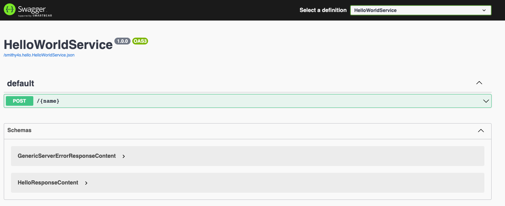
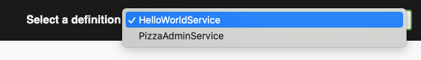

At build-time, when encountering a service annotated with the `simpleRestJson` protocol, Smithy4s will automatically generate an openapi "view" for this service.

```kotlin
namespace smithy4s.example

use smithy4s.api#simpleRestJson

@simpleRestJson
service HelloWorldService {
  version: "1.0.0",
  operations: [Hello]
}
```

The `smithy4s-http4s-swagger` module provides a one liner function to serve swagger-ui using that generated openapi view. By default, the documentation is routed under the `/docs` path.

In `build.sbt`

```scala
libraryDependencies ++= Seq(
  // version sourced from the plugin
  "com.disneystreaming.smithy4s"  %% "smithy4s-http4s-swagger" % smithy4sVersion.value
)
```

In `Docs.scala`, create an instance of the documentation `HttpRoutes`. There are multiple ways to do that. Pick the one you need:

```scala mdoc:compile-only
import org.http4s._
import cats.effect.IO
// the package under which the scala code was generated
import smithy4s.hello._

object Docs {
  //simplest
  val myDocRoutes : HttpRoutes[IO] =
    smithy4s.http4s.swagger.docs[IO](HelloWorldService)

  // documentation served at /custom-docs
  val customPath : HttpRoutes[IO] =
    smithy4s.http4s.swagger.atPath("custom-docs")(HelloWorldService)

  // documentation served at /docs with multiple service specification defined.
  val multipleServices : HttpRoutes[IO] =
    smithy4s.http4s.swagger.docs[IO](HelloWorldService, HelloWorldService)

  // documentation served at /custom-docs with swagger assets from `/swagger-ui-path`
  // (from the classpath) being used.
  val customSetup =
    smithy4s.http4s.swagger.Docs.build[IO]("custom-docs", "/swagger-ui-path")(HelloWorldService)
}
```

```scala mdoc:invisible
// the package under which the scala code was generated
import smithy4s.hello._

import cats.effect.IO

object HelloWorldImpl extends HelloWorldService[IO] {

  def hello(name: String, town: Option[String]) : IO[Greeting] = IO.pure {
    town match {
      case None => Greeting(s"Hello $name !")
      case Some(t) => Greeting(s"Hello $name from $t !")
    }
  }

}
```

As a reminder, http4s' `HttpRoutes` can be composed using the `<+>` operator

```scala mdoc:compile-only
import smithy4s.http4s._
import smithy4s.http4s.swagger.docs
import cats.effect.IO
import cats.implicits._
import org.http4s.implicits._
import smithy4s.hello._

// ...
val docRoutes = docs[IO](HelloWorldService)
val app = SimpleRestJsonBuilder
  .routes(HelloWorldImpl)
  .make
  .map(serviceRoutes => docRoutes <+> serviceRoutes)
  .map(_.orNotFound)
// ...
```

## Swagger UI

When you visit your documentation page, you'll be served with a Swagger UI application that looks like this:



If your documentation route supports multiple service, the dropdown in the top bar (top right) should allow you to select other specifications:

